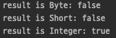
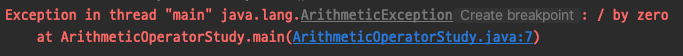
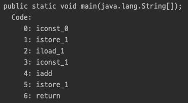
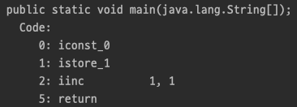
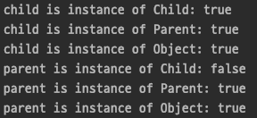
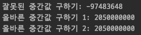

# Java Operator

자바는 필요에 따라 사용할 수 있는 다양한 유형의 연산자를 제공한다.

## 산술 연산자, Arithmetic Operators

기본형의 간단한 산술 연산을 수행하는데 사용된다.

#### Addition `+`

이항 연산자이며 두 개의 피연산자를 더하는 데 사용된다.

#### Subtraction `-`

이항 연산자이며 두 피연산자를 빼는 데 사용된다.

#### Multiplication `*`

이항 연산자이며 두 피연산자를 곱하는 데 사용된다.

#### Division `/`

이항 연산자이며 첫 번째 피연산자(dividend)를 두 번째 피연산자(divisor)로 나누고 그 결과로 몫을 구하는 데 사용된다.

#### Modulus `%`

이항 연산자이며 첫 번째 피연산자(dividend)를 두 번째 피연산자(divisor)로 나누고 그 결과로 나머지를 구하는 데 사용된다.

이상 이항 연산자에 대해서 알아보았다.  
모든 이항 연산자는 연산 수행을 할 때 다음과 같은 특징이 있다.

1. int 형(4 byte)보다 크기가 작은 피연산자들 간의 연산은 int 형으로 변환 후에 연산을 수행한다.

```java
public class ArithmeticOperatorStudy {

    public static void main(String[] args) {
        byte byteOperand = 10;
        short shortOperand = 10;

        Object result = byteOperand + shortOperand;

        System.out.println("result is Byte: " + (result instanceof Byte)));
        System.out.println("result is Short: " + (result instanceof Short));
        System.out.println("result is Integer: " + (result instanceof Integer));
    }
}
```



2. 두 개의 피연산자 중 표현 범위가 큰 쪽에 맞춰서 형 변환 된 후 연산을 수행한다.

```java
public class ArithmeticOperatorStudy {

    public static void main(String[] args) {
        byte byteOperand = 10;
        float floatOperand = 10f;

        Object result = byteOperand + floatOperand;

        System.out.println("result is Byte: " + (result instanceof Byte));
        System.out.println("result is Short: " + (result instanceof Short));
        System.out.println("result is Integer: " + (result instanceof Integer));
        System.out.println("result is Float: " + (result instanceof Float));
    }
}
```


3. 정수형 간의 나눗셈에서 0으로 나누는 것은 불가능하다.

```java
public class ArithmeticOperatorStudy {

    public static void main(String[] args) {
        int dividend = 10;
        int divisor = 0;

        int result = dividend / divisor;
        System.out.println(result);
    }
}
```

위와 같이 0으로 나눌 경우, java.lang.ArithmeticException 예외가 발생하는 것을 확인할 수 있다.



#### Increment `++`

단항 연산자이며 피연산자의 정수 값을 증가시키는 데 사용된다.  
해당 연산자를 사용하는 방법에는 두 가지가 있다.

- Post-increment  
  해당 명령문이 실행될 때까지는 피연산자의 값이 일시적으로 유지되고 다음 명령문 실행 전에 증가한다.

- Pre-increment  
  해당 명령문이 실행될 때 피연산자의 값이 즉시 증가한다.

    - ++i 와 i=i+1 의 비교  
      '++i' 와 'i=i+1' 의 결과는 서로 같지만 실제로 연산이 수행되는 과정은 다르다.  
      '++i' 가 'i=i+1' 보다 더 적은 명령만으로 연산을 수행하기 때문에 더 빠르다.
      ```java
      public class ArithmeticOperatorStudy {
          public static void main(String[] args) {
              int i = 0;
              i = i + 1;
          }
      }
      ```
      
      ```java
      public class ArithmeticOperatorStudy {
          public static void main(String[] args) {
              int i = 0;
              ++i;
          }
      }
      ```
      

#### Decrement `--`

단항 연산자이며 피연산자의 정수 값을 감소시키는 데 사용된다. 해당 연산자를 사용하는 방법에는 두 가지가 있다.

- Post-decrement  
  해당 명령문이 실행될 때까지는 피연산자의 값이 일시적으로 유지되고 다음 명령문 실행 전에 감소한다.

- Pre-decrement  
  해당 명령문이 실행될 때 피연산자의 값이 즉시 감소한다.

## 비트 연산자, Bitwise Operators

비트 연산자는 숫자의 개별 비트를 조작하는 데 사용된다.  
모든 정수형에서 함께 사용할 수 있다.  

#### OR `|`

피연산자간의 OR 연산을 수행한다.  
비트 중 하나라도 1이면 1을, 그렇지 않으면 0을 반환한다.

```text
a = 5 = 0101
b = 7 = 0111
        ----
a | b = 0111 = 7 
```

#### AND `&`

피연산자간의 AND 연산을 수행한다.  
두 비트가 모두 1이면 1을, 그렇지 않으면 0을 반환한다.

```text
a = 5 = 0101
b = 7 = 0111
        ----
a & b = 0101 = 5 
```

#### XOR `^`

피연산자간의 XOR 연산을 수행한다.  
두 비트가 서로 다르면 1을, 같다면 0을 반환한다.  

```text
a = 5 = 0101
b = 7 = 0111
        ----
a ^ b = 0010 = 2 
```

#### 비트 보수 `~`

피연산자의 보수를 반환한다.
즉, 비트를 반전시켜 1을 0, 0을 1로 반환한다.  

```text
a = 5 = 0101
        ----
   ~a = 1010 = 10
```

## 쉬프트 연산자, Shift Operators

숫자의 비트를 왼쪽 또는 오른쪽으로 이동하여 숫자를 각각 2로 곱하거나 나누는 데 사용된다.  

#### Signed Right shift `>>`

숫자의 비트를 오른쪽으로 이동하고 왼쪽 공백을 부호 비트(음수의 경우 1, 양수의 경우 0)로 채운다.  

```java
public class ShiftOperatorStudy {

    public static void main(String[] args) {
        int operand = 10;
        System.out.println(operand >> 1);   // 5
        System.out.println(operand >> 2);   // 2
    }
}
```

10의 비트는 0000 1010 이며, >> 1 을 하게 되면 오른쪽으로 한 번만 이동하되 왼쪽 공백은 부호비트 0 으로 채우게 된다.  
따라서 10 >> 1 의 값은 0000 0101 이며 정수로는 5 가 된다.

#### Unsigned Right shift `>>>`

숫자의 비트를 오른쪽으로 이동하고 왼쪽 공백은 0 으로 채운다.  
부호없는 쉬프트 연산이다.  

양수인 경우는, Signed right shift 결과와 동일하지만 음수인 경우는 부호비트를 보존하지 않기 때문에 다른 결과가 나온다.  

```java
public class ShiftOperatorStudy {

    public static void main(String[] args) {
        int operand = -10;
        System.out.println(operand >>> 1);  // 2147483643
        System.out.println(operand >>> 2);  // 1073741821
    }
}
```

#### Left shift `<<`

숫자의 비트를 왼쪽으로 이동하고 오른쪽 공백은 0 으로 채운다.

```java
public class ShiftOperatorStudy {

    public static void main(String[] args) {
        int operand = 10;
        System.out.println(operand << 1);   // 20
        System.out.println(operand << 2);   // 40
    }
}
```

10의 비트는 0000 1010 이며, << 1 를 하게 되면 왼쪽으로 한 번만 이동하되 오른쪽 공백은 0 으로 채우게 된다.  
따라서 10 << 1 의 값은 0001 0100 이며 정수로는 20 이 된다.

#### Unsigned Left shift `<<<`

부호없는 오른쪽 쉬프트와 달리 << 와 <<< 연산은 동일하기 때문에 별도의 <<< 연산자는 존재하지 않는다.

## 관계 연산자, Relational Operators

관계 연산자는 같음, 보다 큼, 보다 작음 등 두 피연산자 간의 관계를 확인하는 데 사용된다.  
비교 후 boolean 결과를 반환한다.  

#### Equal to `==`

두 피연산자가 같은지 확인하는데 사용된다.  
두 피연산자가 같으면 true 를 반환하고, 다르면 false 를 반환한다.  

#### Not equal to `!=`

두 피연산자가 다른지 확인하는데 사용된다.
두 피연산자가 다르면 true 를 반환하고, 같으면 false 를 반환한다.

#### Greater than `>`

첫 번째 피연산자가 두 번째 피연산자보다 큰지 확인하는데 사용된다.  
첫 번째 피연산자가 더 크다면 true 를 반환하고, 두 번째 피연산자가 더 크다면 false 를 반환한다.

#### Less than `<`

첫 번째 피연산자가 두 번째 피연산자보다 작은지 확인하는데 사용된다.  
첫 번째 피연산자가 더 작다면 true 를 반환하고, 두 번째 피연산자가 더 작다면 false 를 반환한다.

#### Greater than or equal to `>=`

첫 번째 피연산자가 두 번째 피연산자보다 크거나 같은지 확인하는데 사용된다.  
첫 번째 피연산자가 더 크거나 같다면 true 를 반환하고, 두 번째 피연산자가 더 크다면 false 를 반환한다.

#### Less than or equal to `<=`

첫 번째 피연산자가 두 번째 피연산자보다 작거나 같은지 확인하는데 사용된다.  
첫 번째 피연산자가 더 작거나 같다면 true 를 반환하고, 두 번째 피연산자가 더 작다면 false 를 반환한다.

## 논리 연산자, Logical Operators

논리 연산자는 논리적 "AND", "OR" 및 "NOT" 작업을 수행하는 데 사용된다.  
한 가지 명심해야 할 점은 첫 번째 조건이 거짓이면 두 번째 조건은 확인하지 않는다는 것입니다. 즉, 단락 효과가 있습니다.

#### 논리적 AND `&&`

고려중인 두 조건이 모두 true 일 때 결과는 true 를 반환한다.  
만약 두 조건 중 하나라도 false 라면 결과는 false 를 반환한다.  

#### 논리적 OR `||`

고려중인 두 조건 중 하나라도 true 일 때 결과는 true 를 반환한다.  
만약 두 조건 모두 false 라면 결과는 false 를 반환한다.  

#### 논리적 NOT `!`

이전 두 논리 연산자와 달리 단항 연산자이며 고려중인 조건이 false 라면 true 를, true 라면 false 를 반환한다.

## instanceof

instanceof 는 참조 변수가 주어진 유형의 객체 참조를 포함하는지 확인하는 데 사용되는 키워드이다.  

```java
class Parent {}
class Child extends Parent {}

public class InstanceofStudy {

    public static void main(String[] args) {
        Parent parent = new Parent();
        Child child = new Child();

        System.out.println("child is instance of Child: " + (child instanceof Child));
        System.out.println("child is instance of Parent: " + (child instanceof Parent));
        System.out.println("child is instance of Object: " + (child instanceof Object));

        System.out.println("parent is instance of Child: " + (parent instanceof Child));
        System.out.println("parent is instance of Parent: " + (parent instanceof Parent));
        System.out.println("parent is instance of Object: " + (parent instanceof Object));
    }
}
```



## Assignment Operator

변수에 값을 할당하는 데 사용된다.  
오른쪽에 있는 값은 왼쪽에 있는 변수의 데이터 유형과 같아야 한다. 그렇지 않으면 컴파일러에서 오류가 발생한다.  

#### `=`

오른쪽의 값을 왼쪽의 변수에 할당하는 데 사용되는 가장 간단한 연산자이다.

#### `+=`

`+` 연산자와 `=` 연산자의 복합이다.  
왼쪽에 있는 변수의 현재 값을 오른쪽에 있는 값과 더한 다음 결과를 왼쪽 변수에 할당한다.  

#### `-=`

`-` 연산자와 `=` 연산자의 복합이다.  
왼쪽에 있는 변수의 현재 값을 오른쪽에 있는 값으로 뺀 다음 결과를 왼쪽 변수에 할당한다.

#### `*=`

`*` 연산자와 `=` 연산자의 복합이다.  
왼쪽에 있는 변수의 현재 값을 오른쪽에 있는 값으로 곱한 다음 결과를 왼쪽 변수에 할당한다.

#### `/=`

`*` 연산자와 `=` 연산자의 복합이다.  
왼쪽에 있는 변수의 현재 값을 오른쪽에 있는 값으로 나눈 다음 결과를 왼쪽 변수에 할당한다.

#### `%=`

`%` 연산자와 `=` 연산자의 복합이다.  
왼쪽에 있는 변수의 현재 값을 오른쪽에 있는 값으로 나눈 다음 나머지 결과를 왼쪽 변수에 할당한다.

## 화살표(->) 연산자

자바 8 부터 지원되는 Lambda Expression(람다 표현식)에서 사용되는 연산자이다.  
메서드 파라미터, 연산자, 코드 블럭 순으로 구성된다.  

관련하여 더 자세한 내용은 자바 람다식에서 다룰 예정이다.

## 3항 연산자, Condition Operator

if ~ else 문을 연산자로 표현할 수 있고 조건에 따라 결과를 반환하다.  
형태는 조건 ? (true 일 경우 실행) : (false 일 경우 실행) 과 같다.  

```java
public class ConditionOperatorStudy {

    public static void main(String[] args) {
        int random = ThreadLocalRandom.current().nextInt();
        String result1;

        if (random > 10) result1 = "if true";
        else result1 = "else";
        System.out.println("if else 문 결과: " + result1);

        String result2 = random > 10 ? "조건문 true" : "조건문 false";
        System.out.println("3항 연산자 결과: " + result2);
    }
}
```

## 연산자 우선순위

<html>
    <table>
        <thead>
            <th>우선순위</th><th>연산자</th><th>설명</th>
        </thead>
        <tbody>
            <tr><td rowspan="3">1</td><td>()</td><td>Parentheses</td></tr>
            <tr><td>[]</td><td>Array subscript</td></tr>
            <tr><td>.</td><td>Member selection</td></tr>
            <tr><td rowspan="2">2</td><td>++</td><td>Unary post-increment</td></tr>
            <tr><td>--</td><td>Unary post-decrement</td></tr>
            <tr><td rowspan="7">3</td><td>++</td><td>Unary pre-increment</td></tr>
            <tr><td>--</td><td>Unary pre-decrement</td></tr>
            <tr><td>+</td><td>Unary plus</td></tr>
            <tr><td>-</td><td>Unary minus</td></tr>
            <tr><td>!</td><td>Unary logical negation</td></tr>
            <tr><td>~</td><td>Unary bitwise complement</td></tr>
            <tr><td>(type)</td><td>Unary type cast</td></tr>
        </tbody>
    </table>
</html>


#### 두 정수의 중간값 구하기

두 정수 begin, end 가 있다고 할 때, 보통 중간값을 구하려고 (begin + end) / 2 를 사용하여 구한다.  
이렇게 하면 원하는 결과를 얻을 수 있지만 잘못된 결과를 얻을 수도 있다.  
두 정수의 합이 데이터 표현범위를 넘어서는 경우에 잘못된 결과가 나오게 된다.  
아래 코드는 잘못된 중간값과 올바른 중간값 구하는 방법을 각각 작성해 보았다.

```java
public class ArithmeticOperatorStudy {

    public static void main(String[] args) {
        int begin = 2_100_000_000;
        int end = 2_000_000_000;

        int result = (begin + end) / 2;
        System.out.println("잘못된 중간값 구하기: " + result);

        int result2 = begin + (end - begin) / 2;
        System.out.println("올바른 중간값 구하기 1: " + result2);

        int result3 = (begin + end) >>> 1;
        System.out.println("올바른 중간값 구하기 2: " + result3);
    }
}
```



<hr>

#### References

> 웹 문서
> - [geeksforgeeks | Operators in Java](https://www.geeksforgeeks.org/operators-in-java/)
> - [geeksforgeeks | Java Arithmetic Operators with Examples](https://www.geeksforgeeks.org/java-arithmetic-operators-with-examples/)
> - [geeksforgeeks | Bitwise operators in Java](https://www.geeksforgeeks.org/bitwise-operators-in-java/)
> - [geeksforgeeks | Java Relational Operators with Examples](https://www.geeksforgeeks.org/java-relational-operators-with-examples/)
> - [geeksforgeeks | Java Logical Operators with Examples](https://www.geeksforgeeks.org/java-logical-operators-with-examples/)
> - [geeksforgeeks | Java instanceof and its applications](https://www.geeksforgeeks.org/java-instanceof-and-its-applications/)
> - [개발매발 | 3주차 과제: 연산자](https://blog.baesangwoo.dev/posts/java-livestudy-3week/)
> - [1의 보수와 2의 보수](https://n수db796.tistory.com/4)
> - [Java Operator Precedence Table](http://www.cs.bilkent.edu.tr/~guvenir/courses/CS101/op_precedence.html)
>
> 도서
> - JAVA의 정석(2ND EDITION) 중 '3장 연산자'