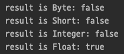

# Java Operator

자바는 필요에 따라 사용할 수 있는 다양한 유형의 연산자를 제공한다.

## 산술 연산자, Arithmetic Operators

기본형의 간단한 산술 연산을 수행하는데 사용된다.

#### Addition `+`

이항 연산자이며 두 개의 피연산자를 더하는 데 사용된다.

#### Subtraction `-`

이항 연산자이며 두 피연산자를 빼는 데 사용된다.

#### Multiplication `*`

이항 연산자이며 두 피연산자를 곱하는 데 사용된다.

#### Division `/`

이항 연산자이며 첫 번째 피연산자(dividend)를 두 번째 피연산자(divisor)로 나누고 그 결과로 몫을 구하는 데 사용된다.

#### Modulus `%`

이항 연산자이며 첫 번째 피연산자(dividend)를 두 번째 피연산자(divisor)로 나누고 그 결과로 나머지를 구하는 데 사용된다.

이상 이항 연산자에 대해서 알아보았다.  
모든 이항 연산자는 연산 수행을 할 때 다음과 같은 특징이 있다.

1. int 형(4 byte)보다 크기가 작은 피연산자들 간의 연산은 int 형으로 변환 후에 연산을 수행한다.

```java
public class ArithmeticOperatorStudy {

    public static void main(String[] args) {
        byte byteOperand = 10;
        short shortOperand = 10;

        Object result = byteOperand + shortOperand;

        System.out.println("result is Byte: " + (result instanceof Byte)));
        System.out.println("result is Short: " + (result instanceof Short));
        System.out.println("result is Integer: " + (result instanceof Integer));
    }
}
```


2. 두 개의 피연산자 중 표현 범위가 큰 쪽에 맞춰서 형 변환 된 후 연산을 수행한다.

```java
public class ArithmeticOperatorStudy {

    public static void main(String[] args) {
        byte byteOperand = 10;
        float floatOperand = 10f;

        Object result = byteOperand + floatOperand;

        System.out.println("result is Byte: " + (result instanceof Byte));
        System.out.println("result is Short: " + (result instanceof Short));
        System.out.println("result is Integer: " + (result instanceof Integer));
        System.out.println("result is Float: " + (result instanceof Float));
    }
}
```



3. 정수형 간의 나눗셈에서 0으로 나누는 것은 불가능하다.

```java
public class ArithmeticOperatorStudy {

    public static void main(String[] args) {
        int dividend = 10;
        int divisor = 0;

        int result = dividend / divisor;
        System.out.println(result);
    }
}
```

위와 같이 0으로 나눌 경우, java.lang.ArithmeticException 예외가 발생하는 것을 확인할 수 있다.


#### Increment `++`

단항 연산자이며 피연산자의 정수 값을 증가시키는 데 사용된다.  
해당 연산자를 사용하는 방법에는 두 가지가 있다.

- Post-increment  
  해당 명령문이 실행될 때까지는 피연산자의 값이 일시적으로 유지되고 다음 명령문 실행 전에 증가한다.

- Pre-increment  
  해당 명령문이 실행될 때 피연산자의 값이 즉시 증가한다.

    - ++i 와 i=i+1 의 비교  
      '++i' 와 'i=i+1' 의 결과는 서로 같지만 실제로 연산이 수행되는 과정은 다르다.  
      '++i' 가 'i=i+1' 보다 더 적은 명령만으로 연산을 수행하기 때문에 더 빠르다.
      ```java
      public class ArithmeticOperatorStudy {
          public static void main(String[] args) {
              int i = 0;
              i = i + 1;
          }
      }
      ```
      
      ```java
      public class ArithmeticOperatorStudy {
          public static void main(String[] args) {
              int i = 0;
              ++i;
          }
      }
      ```
      

#### Decrement `--`

단항 연산자이며 피연산자의 정수 값을 감소시키는 데 사용된다. 해당 연산자를 사용하는 방법에는 두 가지가 있다.

- Post-decrement  
  해당 명령문이 실행될 때까지는 피연산자의 값이 일시적으로 유지되고 다음 명령문 실행 전에 감소한다.

- Pre-decrement  
  해당 명령문이 실행될 때 피연산자의 값이 즉시 감소한다.

## 비트 연산자, Bitwise Operators

비트 연산자는 숫자의 개별 비트를 조작하는 데 사용된다.  
모든 정수형에서 함께 사용할 수 있다.  

#### OR `|`

피연산자간의 OR 연산을 수행한다.  
비트 중 하나라도 1이면 1을, 그렇지 않으면 0을 반환한다.

```text
a = 5 = 0101
b = 7 = 0111
        ----
a | b = 0111 = 7 
```

#### AND `&`

피연산자간의 AND 연산을 수행한다.  
두 비트가 모두 1이면 1을, 그렇지 않으면 0을 반환한다.

```text
a = 5 = 0101
b = 7 = 0111
        ----
a & b = 0101 = 5 
```

#### XOR `^`

피연산자간의 XOR 연산을 수행한다.  
두 비트가 서로 다르면 1을, 같다면 0을 반환한다.  

```text
a = 5 = 0101
b = 7 = 0111
        ----
a ^ b = 0010 = 2 
```

#### 비트 보수 `~`

피연산자의 보수를 반환한다.
즉, 비트를 반전시켜 1을 0, 0을 1로 반환한다.  

```text
a = 5 = 0101
        ----
   ~a = 1010 = 10
```

## 관계 연산자, Relational Operators

관계 연산자는 같음, 보다 큼, 보다 작음 등 두 피연산자 간의 관계를 확인하는 데 사용된다.  
비교 후 boolean 결과를 반환한다.  

#### Equal to `==`

두 피연산자가 같은지 확인하는데 사용된다.  
두 피연산자가 같으면 true 를 반환하고, 다르면 false 를 반환한다.  

#### Not equal to `!=`

두 피연산자가 다른지 확인하는데 사용된다.
두 피연산자가 다르면 true 를 반환하고, 같으면 false 를 반환한다.

#### Greater than `>`

첫 번째 피연산자가 두 번째 피연산자보다 큰지 확인하는데 사용된다.  
첫 번째 피연산자가 더 크다면 true 를 반환하고, 두 번째 피연산자가 더 크다면 false 를 반환한다.

#### Less than `<`

첫 번째 피연산자가 두 번째 피연산자보다 작은지 확인하는데 사용된다.  
첫 번째 피연산자가 더 작다면 true 를 반환하고, 두 번째 피연산자가 더 작다면 false 를 반환한다.

#### Greater than or equal to `>=`

첫 번째 피연산자가 두 번째 피연산자보다 크거나 같은지 확인하는데 사용된다.  
첫 번째 피연산자가 더 크거나 같다면 true 를 반환하고, 두 번째 피연산자가 더 크다면 false 를 반환한다.

#### Less than or equal to `<=`

첫 번째 피연산자가 두 번째 피연산자보다 작거나 같은지 확인하는데 사용된다.  
첫 번째 피연산자가 더 작거나 같다면 true 를 반환하고, 두 번째 피연산자가 더 작다면 false 를 반환한다.


#### 두 정수의 중간값 구하기

두 정수 begin, end 가 있다고 할 때, 보통 중간값을 구하려고 (begin + end) / 2 를 사용하여 구한다.  
이렇게 하면 원하는 결과를 얻을 수 있지만 잘못된 결과를 얻을 수도 있다.  
두 정수의 합이 데이터 표현범위를 넘어서는 경우에 잘못된 결과가 나오게 된다.  
아래 코드는 잘못된 중간값과 올바른 중간값 구하는 방법을 각각 작성해 보았다.

```java
public class ArithmeticOperatorStudy {

    public static void main(String[] args) {
        int begin = 2_100_000_000;
        int end = 2_000_000_000;

        int result = (begin + end) / 2;
        System.out.println("잘못된 중간값 구하기: " + result);

        int result2 = begin + (end - begin) / 2;
        System.out.println("올바른 중간값 구하기 1: " + result2);

        int result3 = (begin + end) >>> 1;
        System.out.println("올바른 중간값 구하기 2: " + result3);
    }
}
```


<hr>

#### References

> 웹 문서
> - [geeksforgeeks | Operators in Java](https://www.geeksforgeeks.org/operators-in-java/)
> - [geeksforgeeks | Java Arithmetic Operators with Examples](https://www.geeksforgeeks.org/java-arithmetic-operators-with-examples/)
> - [geeksforgeeks | Bitwise operators in Java](https://www.geeksforgeeks.org/bitwise-operators-in-java/)
> - [geeksforgeeks | Java Relational Operators with Examples](https://www.geeksforgeeks.org/java-relational-operators-with-examples/)
>
> 도서
> - JAVA의 정석(2ND EDITION) 중 '3장 연산자'